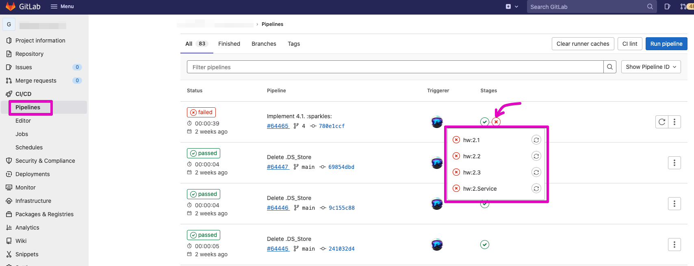

# golang.proposal

Обновление домашних заданий и принципа сдачи на ревью

- [golang.proposal](#golangproposal)
  - [Как работает grader](#как-работает-grader)
  - [Как использовать данный репозиторий](#как-использовать-данный-репозиторий)
    - [Шаблонизация репозитория для студентов](#шаблонизация-репозитория-для-студентов)
    - [Изменения в заданиях](#изменения-в-заданиях)
      - [1.4.3 Процесс работы с gitlab и ревьюверами](#143-процесс-работы-с-gitlab-и-ревьюверами)
      - [1.6.X Общее описание задачи на микросервис](#16x-общее-описание-задачи-на-микросервис)
      - [2.5](#25)
      - [2.6.1 Задание для закрепления навыков](#261-задание-для-закрепления-навыков)
      - [2.6.2 Задание для закрепления навыков](#262-задание-для-закрепления-навыков)
      - [2.6.3 Задание для закрепления навыков](#263-задание-для-закрепления-навыков)
      - [2.7.1 Задание для создания микросервиса](#271-задание-для-создания-микросервиса)
      - [3.5.1 Задание для закрепления навыков](#351-задание-для-закрепления-навыков)
      - [3.5.2 Задание для закрепления навыков](#352-задание-для-закрепления-навыков)
      - [3.6.1 Задание для создания микросервиса](#361-задание-для-создания-микросервиса)
      - [3.6.2 Задание для создания микросервиса](#362-задание-для-создания-микросервиса)
      - [4.6.1 Задание для закрепления навыков](#461-задание-для-закрепления-навыков)
      - [4.6.2 Задание для закрепления навыков](#462-задание-для-закрепления-навыков)
      - [4.6.3 Задание для закрепления навыков](#463-задание-для-закрепления-навыков)
      - [4.6.4 Задание для закрепления навыков](#464-задание-для-закрепления-навыков)
      - [4.7.1 Задание для создания микросервиса](#471-задание-для-создания-микросервиса)
      - [5 ПЕРЕНОС ТЕОРИИ 6.2 Пакеты http в 5.7](#5-перенос-теории-62-пакеты-http-в-57)
      - [5.8.1 Задание для закрепления навыков](#581-задание-для-закрепления-навыков)
      - [5.8.2 Задание для закрепления навыков](#582-задание-для-закрепления-навыков)
      - [5.9.1 Задание для создания микросервиса](#591-задание-для-создания-микросервиса)
      - [6.2.1 Задание для создания микросервиса т.к. 6.2 был перенесен, то этот пункт освободился](#621-задание-для-создания-микросервиса-тк-62-был-перенесен-то-этот-пункт-освободился)
      - [6.4.1 Задание для создания микросервиса](#641-задание-для-создания-микросервиса)
      - [6.4.2 Задание для создания микросервиса - УДАЛЯЕМ](#642-задание-для-создания-микросервиса---удаляем)
      - [6.5.1-2 Задание для создания микросервиса - УДАЛЯЕМ](#651-2-задание-для-создания-микросервиса---удаляем)
      - [6.9.1 Задание для создания микросервиса - УДАЛЯЕМ](#691-задание-для-создания-микросервиса---удаляем)
      - [6.11.1 Задание для создания микросервиса замена 6.11.1 на 6.11.2](#6111-задание-для-создания-микросервиса-замена-6111-на-6112)
      - [7.17.1 Задание для закрепления навыков](#7171-задание-для-закрепления-навыков)
      - [7.18.1 Задание для создания микросервиса](#7181-задание-для-создания-микросервиса)
      - [7.18.2 Задание для создания микросервиса](#7182-задание-для-создания-микросервиса)
      - [8.13.1 Задание для создания микросервиса](#8131-задание-для-создания-микросервиса)
      - [8.13.2 Задание для создания микросервиса](#8132-задание-для-создания-микросервиса)
      - [8.13.3 Задание для создания микросервиса](#8133-задание-для-создания-микросервиса)

## Как работает grader

Grader-ом у нас будет gitlab-ci и его раннеры.

```bash
├── .gitlab-ci      # директория с файлами gitlab-ci: общие переменные, шаги тестирования
│   ├── default.yml # Общие переменные
│   ├── prepare.yml # Helper для вывода переменных окружения gitlab-a
│   └── test.yml    # Шаги тестирования с правилами запуска
├── .gitlab-ci.yml  # основной gitlab-ci файл
```

Правила содержат основое условие - изменения в файлах определенной директории

```yaml
rules:
    - changes:  # Include the job and set to when:manual if any of the follow paths match a modified file.
        - Exercises/2.Basics/1/*.go
```

Основной скрипт - элементарная проверка форматирования и запуск тестов

```yaml
  script:
    - if [[ -n $(gofmt -l Exercises/2.Basics/1/) ]]; then echo "Необходимо отформатировать код при помощи gofmt" && exit 1; fi
    - go test -v Exercises/2.Basics/1/*.go
    - echo "Домашка 2.1 пройдена! Можно сдавать на ревью!"
```

Студент может запустить тесты у себя локально, затем пушить уже на сервер.

## Как использовать данный репозиторий

### Шаблонизация репозитория для студентов

В репозитории https://gitlab.slurm.io/GoForOps/gotemplate удалить все, затем скопировать туда из этого репозитория файлы:

- .gitlab-ci/ -> .gitlab-ci/
- Exercises/ -> Exercises/ все go файлы! (readme.md НЕ НАДО!)
- Service/main.go -> Service/main.go
- .gitignore -> .gitignore
- .gitlab-ci.yml -> .gitlab-ci.yml
- go.mod -> go.mod
- go.sum -> go.sum

### Изменения в заданиях

Нумерация дана для курса "Golang для инженеров FULL-BUY, поток 2"

#### 1.4.3 Процесс работы с gitlab и ревьюверами

Перед `ШАГ 5` вставить:

Для самопроверки и ускорения ревью мы подготовили тесты к заданиям на самопроверку, если вы все сделали правильно, то после пуша изменений на сервер должен запуститься GitLab CI pipeline с тестами.  Как писать и запускать тесты вы узнаете в первой части курса и сможете запускать их локально.  
После пуша изменений можно открыть CI/CD>Pipelines в gitlab-e и посмотреть статус



ШАГ 5. Копируем ссылку на Merge Request в Gitlab-e с выполненным заданием и добавляем её в Личном кабинете в поле для...

#### 1.6.X Общее описание задачи на микросервис

Текущее представление не годится! Требуется удалить все 5 шагов и вместо них вставить один:

Вставить туда содержимое файла Service.md, картинки желательно оставить как есть - они простые и понятные!

#### 2.5

После пункта `2.5 Циклы, switch-case, if` перенести пункт `6.7 Как писать тесты?`

#### 2.6.1 Задание для закрепления навыков

Заменить на:

Реализуйте функцию `doubleDetector(nums []int) bool` которой на вход подается целочисленный массив nums, на выход должно вывести true, если хотя бы одно значение встречается в массиве как минимум дважды, и false, если каждый элемент различен.

Литература:

1. "Язык программирования Go" Алан А.А.Донован, Брайан У.Керниган 2016г.: Глава 4, параграфы 1-3;
2. "Golang для профи" Михалис Цукалос 2ое изд 2020г.: Глава 3 циклы в Go, массивы в Go, срезы в Go
3. Effective Go: https://go.dev/doc/effective_go#control-structures, https://go.dev/doc/effective_go#functions, https://go.dev/doc/effective_go#slices

#### 2.6.2 Задание для закрепления навыков

Заменить на:

Реализуйте функцию `func isSorted(ww []string) bool` которой на вход подается непустой слайс состоящий из строк, необходимо вернуть `true` тогда и только тогда, когда все слова в слайсе отсортированы лексикографически по возрастанию относительно друг друга. В ином случае вывести `false`. Продемонстрировать использование функции.

Литература:

1. "Язык программирования Go" Алан А.А.Донован, Брайан У.Керниган 2016г.: Глава 4, параграфы 1-3;
2. "Golang для профи" Михалис Цукалос 2ое изд 2020г.: Глава 3 циклы в Go, массивы в Go, срезы в Go
3. Effective Go: https://go.dev/doc/effective_go#control-structures, https://go.dev/doc/effective_go#functions, https://go.dev/doc/effective_go#slices
4. Go пакет sort - https://pkg.go.dev/sort

#### 2.6.3 Задание для закрепления навыков

Заменить на:

Реализуйте функцию `func stringStat(word string) string` которая используя тип данных map посчитает сколько раз встречается каждый символ во входной строке и выведет строку в формате `символ - количество` для каждого символа новая строка. Вывод инфорации о символе должен осуществляться в том же порядке, в каком он встречается во входной фразе в первый раз. Все символы переводить в нижний регистр, пробелы не считать.

Пример: Для строки “Старт и финиш” вывод будет следующий
с - 1
т - 2
а - 1
р - 1
и - 3
ф - 1
н - 1
ш - 1

Литература:

1. "Язык программирования Go" Алан А.А.Донован, Брайан У.Керниган 2016г.: Глава 4, параграфы 1-3;
2. "Golang для профи" Михалис Цукалос 2ое изд 2020г.: Глава 3 циклы в Go, массивы в Go, срезы в Go
3. Effective Go: https://go.dev/doc/effective_go#control-structures, https://go.dev/doc/effective_go#functions, https://go.dev/doc/effective_go#slices

#### 2.7.1 Задание для создания микросервиса

Заменить на:

Структурная схема нашей системы на текущий момент


Хотя мы только начали знакомиться с языком Go, мы уже можем сделать что-то полезное в рамках нашего большого задания по разработке микросервисов.

Например нашему модулю Checker потребуются структуры для хранения результатов проверок внешних отслеживаемых сервисов.  
Давайте создадим такую структуру, назовем ее HealthCheck. Она должна содержать два поля: ServiceID (здесь будет хранить идентификатор отслеживаемого сервиса) и Status (результат его проверки) - обе типа string. Объявим также константы для состояний Status

```go
const (
  PassStatus = "pass"
  FailStatus = "fail"
)
```

Так же для вас разработан вспомогательноый сервис [GoMetr](https://gitlab.slurm.io/GoForOps/gometr), вам необходимо сделать git clone к себе на компьютер и запустить его. После запуска открыть в браузере ссылки `http://localhost:8000/metrics` и `http://localhost:8000/health`  
8000 порт указан для текущего конфига, если он у вас занят изменить значение в конфиг файле и повторите запуск.  
*Подсказка*: в репозитрии есть `Makefile` где прописана команда запуска.

#### 3.5.1 Задание для закрепления навыков

Заменить на:

Необходимо разработать структуры, описывающие геометрические фигуры прямоугольник и круг (`Rectangle` и `Circle`). Дан интерфейс `Shape`, описывающий два метода: Area() float64 и Type() string.

- Структуры должны реализовывать этот интерфейс
- Метод Type() должен возвращать строковое название типа фигуры
- метод Area() должен возвращать площадь фигуры
- Area() должны вычисляться именно для того экземпляра фигуры, метод которой мы вызвали (использовать константу pi)
- Размеры фигур должны храниться в самой структуре
- Для каждой сруктуры реализовать конструктор `New<ShapeName>`

После создания интерфейса и структур с методами реализуйте функцию `func AreaCalculator(figures []Shape) (string, float64)`, которая должна выводить описание результирующей фигуры в формате "название фигуры1-название фигуры2" и ее площадь. Например если у вас Rectangle имеет имя прямоугольник и площадь 5, а в функцию передано 3 таких фигуры, то результат должен быть таким: прямоугольник-прямоугольник-прямоугольник, 15.

На ваше усмотрение можно добавить и другие фигуры помимо прямоугольника и окружности и дополнить тестовые сценарии.

Литература:

1. "Язык программирования Go" Алан А.А.Донован, Брайан У.Керниган 2016г.: Глава 7, параграфы 1-3;
2. "Golang для профи" Михалис Цукалос 2ое изд 2020г.: Глава 4 пакет strings, Глава 7 Интерфецсы в Go
3. Effective Go: https://go.dev/doc/effective_go#interfaces_and_types, https://go.dev/doc/effective_go#type_switch, https://go.dev/doc/effective_go#embedding
4. https://pkg.go.dev/strings

#### 3.5.2 Задание для закрепления навыков

Заменить на:

> Текст задания менять не надо, только доплонить ссылку на литературу

Литература:

1. "Golang для профи" Михалис Цукалос 2ое изд 2020г.: Глава 5 Связные списки в Go

#### 3.6.1 Задание для создания микросервиса

Заменить на:

Описание интерфейса Cheсkable и его реализация с заглушками

Структурная схема нашей системы на текущий момент


Мы приступаем уже к серьезной разработке нашего сервиса-монитора.

Для единообразия наших решений и удобства проверки, будем согласовывать в заданиях имена файлов, места их размещения в проекте и названия структур, методов, констант и т.д.

1.) В папке ./Service нашего репозитория создадим файл `checker.go` в него включим все, что непосредственно относится к блоку Checker.  
Определим в нем интерфейс Checkable. По этому интерфейсу Checker будет взаимодействовать с модулями для проверки состояний отслеживаемых сервисов.

Checkable имеет методы:

- GetID()                     - возвращает строку
- Health(context.Context)     - возвращает истина или ложь
- GetMetrics(context.Context) - возвращает строку

Создадим структуру Checker, пока она будет пустой.  
Добавим Checker-у метод `check(ctx context.Context, c Checkable)`, который на вход получает контекст и интерфейс Checkable, он должен выполнить проверку Health у переданного интерфейса. Если проверка провалена - выводим на экран `fmt.Println(c.GetID(), "не работает")`.

2.) Теперь в папке ./Service нашего репозитория создадим еще один файл `gometr.go`, и внесем в него часть кода, необходимого нашему сервису-монитору для взаимодействия с отслеживаемым сервисом goMetr

Создадим структуру GoMetrClient, и приведем ее в соответствие интерфейсу Checkable. Пока ограничимся объявлением методов с нужной сигнатурой, правильно реализовывать их поведение будем позже.  
Рекомендуем воспользоваться проверкой на соответствие интерфейсу при компиляции - https://github.com/uber-go/guide/blob/master/style.md#verify-interface-compliance

В структуре GoMetrClient нам потребуется поле ServiceID, в котором мы будем хранить идентификатор сервиса, чтобы возвращать его по запросу GetID.  
Нам потребуется метод `getHealth(ctx context.Context) HealthCheck` который будет возвращать структуру HealthCheck.  
Пока что ограничимся имитацией его работы - пусть возвращаемое значение будет постоянным, или зависящим от ServiceID, пока реальных проверок делать не будем.  
В реализации метода Health() должен вызываться метод getHealth.

Создадим для GoMetrClient функцию-конструктор.

#### 3.6.2 Задание для создания микросервиса

Добавить задание:

Структурная схема нашей системы на текущий момент


1.) В файле `checker.go` структуре Checker добавим поле, содержащее слайс из Checkable интерфейсов - наши таргеты для мониторинга.

Добавим Checker-у методы:

- `Add(item Checkable)`, который будет добавлять в вышеупомянутый слайс новые Checkable экземпляры
- `String() string`, мы хотим, чтобы можно было выводить на экран состояние объекта Checker. Это удобно делать с помощью функции fmt.Print(), но чтобы в нее можно было передать наш Checker, и информация из него была выведена желаемым образом, необходимо, чтобы наш Checker соответствовал интерфейсу Stringer. Для этого реализуем необходимый метод, который будет возвращать результаты всех GetID добавленных в Checker элементов
- Check(), самый главный метод. Он должен выполнять проверки Health добавленных в чекер элементов, вызывая для каждого из них метод `check(ctx context.Context, c Checkable)`

Создадим для Checker-a функцию-конструктор.

2.) Теперь мы сможем сделать первую имитацию работы нашего сервиса.

В файле ./Service/main.go в функции main() добавим следующие шаги:

- мы можем вызвать конструктор, возаращающий Checker
- через конструктор создать несколько экземпляров GoMetrClient. При создании задавайте им разные ServiceID, чтобы можно было их отличать.
- через метод Add мы можем добавить созданные GoMetrClient'ы в Checker
- Можем с помощью fmt.Print() вывести на экран список всех зарегистрированных у Checker GoMeterClient'ов
- и можем вызвать метод Check, получив на экране список работающих и неработающих "сервисов", отслеживание которых пока имитирует GoMetrClient.

Превращением имитации поведения в реальное мы займемся в следующих домашних заданиях.

#### 4.6.1 Задание для закрепления навыков

Заменить на:

> Текст задания менять не надо, только доплонить ссылку на литературу

Литература:

1. "Язык программирования Go" Алан А.А.Донован, Брайан У.Керниган 2016г.: Глава 5, параграфы 9-10;
2. "Golang для профи" Михалис Цукалос 2ое изд 2020г.: Глава 2 Функции panic() и recover()
3. Effective Go: https://go.dev/doc/effective_go#panic

#### 4.6.2 Задание для закрепления навыков

Заменить на:

Реализуйте функцию `func realMain(goroutineDuration time.Duration) error`, которая запускает несколько горутин и 2 секунды ожидает их выполнения. Если горутины успевают закончиться своевременно, функция ошибку не возвращает. Если же по истечение 2 секунд ожидания завершились не все горутины, функция, не ожидая более, возвращает ошибку. Параметр `goroutineDuration` - указывает сколько будет длиться выполнение одной горутины, нужен для тестов.

Напишите программу, демонстрирующую работу функции.

Литература:

1. "Язык программирования Go" Алан А.А.Донован, Брайан У.Керниган 2016г.: Глава 8, параграф 7;
2. "Golang для профи" Михалис Цукалос 2ое изд 2020г.: Главы 9 и 10
3. Effective Go: https://go.dev/doc/effective_go#concurrency

#### 4.6.3 Задание для закрепления навыков

Заменить на:

Реализуйте функцию `func realMain(ctx context.Context, num int)`, которая запускает несколько горутин, передавая в них контекст. Потом через несколько секунд (например 5) функция отменяет контекст, и созданные го-рутины должны отреагировать на отмену контекста: вывести на экран сообщение и завершиться. Параметр `num` - указывает сколько именно горутин нужно запустить, нужен для тестов.

Напишите программу, демонстрирующую работу функции.

Литература:

1. "Язык программирования Go" Алан А.А.Донован, Брайан У.Керниган 2016г.: Глава 8, параграф 7;
2. "Golang для профи" Михалис Цукалос 2ое изд 2020г.: Главы 9 и 10
3. Effective Go: https://go.dev/doc/effective_go#concurrency

#### 4.6.4 Задание для закрепления навыков

Заменить на:

* Даны два слайса одинаковой длины с целыми числами. Слайс `a` содержит в себе последовательные нечетные числа ({1,3,5,7,9}), слайс `b` содержит в себе последовательные четные числа ({2,4,6,8,10}).
Необходимо получить слайс `c`, в котором будут все числа из слайсов `a` и `b` по порядку.
Слайс `c` необходимо получить следующим образом: реализовать функцию `realMain(a, b []int, c *[]int)` внутри которой необходимо создать несколько горутин, минимум две одна из которых будет записывать в слайс нечетные числа, другая - четные, и добиться от них точного чередования работы. Обратите внимание на третий параметр `c *[]int` слайс передается по указателю - сделано для того, чтобы его можно было модифицировать.

Функция main() должна запустить `realMain`, дождаться завершения и вывести на экран готовый слайс `c`.
Для обеспечения чередования работы горутин рекомендуем использовать каналы.

Литература:

1. "Язык программирования Go" Алан А.А.Донован, Брайан У.Керниган 2016г.: Глава 9 параграф 1-2;
2. "Golang для профи" Михалис Цукалос 2ое изд 2020г.: Главы 10 Выбор последовательности исполнения горутин
3. Effective Go: https://go.dev/doc/effective_go#concurrency

#### 4.7.1 Задание для создания микросервиса

Заменить на:

Структурная схема нашей системы на текущий момент


1.) В данный момент наша реализация метода Check у Checker имеет существенный недостаток: если в процессе его выполнения какая-то из проверок по какой-то причине задержится надолго, на это же время задержится выполнение других проверок, т.к. они выполняются последовательно. А если какая-то из проверок не завершится никогда, это вообще нарушит работу нашего сервиса-монитора. Давайте это исправим, перейдя от синхронных вызовов к асинхронным.

Мы могли бы в цикле метода Check вызывать каждую проверку в отдельной горутине, но этого недостаточно, т.к. не позволяет сделать проверки регулярными и управляемыми.

Ставим себе следующую задачу:

- Мы хотим, чтобы каждая из проверок выполнялась независимо от другой
- Мы хотим, чтобы каждая из проверок была ограничена по времени (если проверка не выполнилась в течение ожидаемого времени - считаем ее неудачной)
- Мы хотим, чтобы Checker не просто выполнил все проверки однократно, а выполнял их регулярно
- Мы хотим, чтобы регулярные проверки можно было остановить

Для выполнения этих задач сделаем следующее:

- Реализуем в Checker метод Run который будет асинхронно запускать метод run
- Реализуем метод run(), который будет каждые 5 секунд просматривать список проверок и асинхронно запускать каждую в отдельной горутине. Метод run должен получать контекст, при отмене которого должны быть отменены уже запущенные проверки, а сам метод run завершится
- Реализуем метод Stop, который должен останавливать работу метода run

Методам Run и Stop желательно добавить вывод на экран сообщений о том, что эти методы выполнились.

Выполнение этих задач приводит к побочным последствиям: теперь у нас методы run() и Add() могут выполняться параллельно, а они в свою очередь работают со слайсом проверок (элементов Checkable), причем метод Add работает с этим слайсом на запись. Потенциально такое использование может привести (и обязательно когда-то приведет) к состоянию гонки (race condition). Так что у нас возникает еще одна задача - устранить этот недостаток.

Для избежания этого нам необходимо добавить в структуру Checker и задействовать мьютекс, который исключит одновременную работу со слайсом items из двух горутин. Также можно в реализации метода Add() задействовать каналы. Это распространенная положительная практика.

2.) Изменение в GoMetrClient. Мы хотим добиться того, чтобы очень длительное или "вечное" выполнение проверки не воспринималось нашим сервисом как нормальная ситуация. Слишком продолжительное выполнение проверки - должна восприниматься Checker'ом как неудачно прошедшая проверка.

Для этого создадим в GoMetrClient еще одно поле (timeOut), в котором мы будем хранить лимит времени на выполнение проверки.

А метод Health мы изменим таким образом, чтобы он не просто вызывал `getHealth(ctx context.Context) HealthCheck`, а ждал его завершения не более того времени, которое определено в timeOut. Если в течение этого времени проверка не завершилась, мы возвращаем такой же результат, как вернули бы при неудачной проверке. Для этого мы можем использовать таймер и каналы.

3.) В папке ./Service нашего репозитория создадим еще один файл `googlemetr.go`, и внесем в него часть кода, необходимого нашему сервису-монитору для взаимодействия с любым вэб сервисом

Отличительная особенность данной реализации Checkable интерфецса состоит в отм, что метод GetMetrics() будет формировать метрики в Prometheus формате сам, а не получать их в готовом виде, как это будет в GoMetrClient-е.

Создадим структуру GoogleMetrClient, и приведем ее в соответствие интерфейсу Checkable. Пока ограничимся объявлением методов с нужной сигнатурой, правильно реализовывать их поведение будем позже.  
Вновь рекомендуем воспользоваться проверкой на соответствие интерфейсу при компиляции - https://github.com/uber-go/guide/blob/master/style.md#verify-interface-compliance

В структуре GoogleMetrClient нам так же как и в GoMetrClient потребуется поле ServiceID, в котором мы будем хранить идентификатор сервиса, чтобы возвращать его по запросу GetID, поле timeOut для остановки зависших проверок.
Реализации всех методов интерфейса Checkable кроме GetID() пока выполняются в виде имитации работы.

Создадим для GoogleMetrClient функцию-конструктор.

#### 5 ПЕРЕНОС ТЕОРИИ 6.2 Пакеты http в 5.7

Требуется перенести часть теории в 5 модуль для более плавного распределения нагрузки  
Добавить в доп материалы ссылку на https://swagger.io/docs/specification/about/ - стандарт по описанию WEB API контрактов.

#### 5.8.1 Задание для закрепления навыков

Для того, чтобы освоить основы пакетов net/http и os, напишите http сервер с эндпоинтом `POST /log`, который принимает строку и помещает её в новую линию в файле, путь к которому определен переменной env `APP_LOGFILE_PATH`. Для этого реализуйте хендлер `func (h *handler) logHTTPHandler(w http.ResponseWriter, r *http.Request)` у структуры `handler`.  

Если путь не определен, то сервер должен использовать свой корень, где он запущен с именем файла log.txt по умолчанию. После записи строки в лог сервер должен вернуть код 200 и OK, если возникает ошибка, то вернуть код 500 и сообщение об ошибке.

Литература:

1. "Язык программирования Go" Алан А.А.Донован, Брайан У.Керниган 2016г.: 7.7. Интерфейс http.Handler
2. "Golang для профи" Михалис Цукалос 2ое изд 2020г.: Глава 8 Интерфейсы io.Reader и io.Writer, Глава 12 Создание веб-сервера на Go

#### 5.8.2 Задание для закрепления навыков

Закрепим навык получения JSON-ответа в теле HTTP-запроса и его десериализацию во внутреннюю структуру программы на Go.

Предположим, что где-то есть сервер, который при обращении по пути /health возвращает следующую JSON-конструкцию, описывающую состояние работы какой-то системы

```json
{
    "status": "pass",
    "service_id": "MBPadmincity101",
    "checks": {
        "ping_mysql": {
            "component_id": "mysql",
            "component_type": "db",
            "status": "pass"
        }
    }
}
```

В этом задании нам необходимо написать программу, которая примет адрес сервера по переданному в программу флагу --url, с помощью веб-клиента обратится по этому адресу, и в случае успешного получения ответа этой структуры выведет на экране значения полей status, service_id и checks.ping_mysql.status  в виде строки “Overall status is %status%, with service_id %значение поля service_id% mysql component is  %начение поля checks.ping_mysql.status%”. А если по какой-либо причине получить ответ от сервера не получилось, то вывести на экран "No data".  
Для этого реализуйте метод `func (c *Client) data() string`.

К решению приложите файл отчета о тестовом покрытии cover.html, для его получения необходимо выполнить 2 команды:

```bash
# перейти в директорию с заданием
go test -coverprofile=cover.out
go tool cover -html=cover.out -o cover.html
```

Литература:

1. "Язык программирования Go" Алан А.А.Донован, Брайан У.Керниган 2016г.: 7.7. Интерфейс http.Handler
2. "Golang для профи" Михалис Цукалос 2ое изд 2020г.: Глава 12 Создание веб-клиента на Go

#### 5.9.1 Задание для создания микросервиса

Добавить задание:

Структурная схема нашей системы на текущий момент


1.) Приведем наш проект в соответствие с рекомендациями [golang-standards/project-layout](https://github.com/golang-standards/project-layout) и перенесем себе GoMetr

Внутри папки ./Service у нас должна получиться примерно такая структура, с учетом этого будут даваться дальнейшие ссылки

```bash
.
├── Makefile                         # файл с наборами команд, взят из проекта GoMetr
├── build
│   └── gometr
│       └── Dockerfile               # Dockerfile взят из проекта GoMetr
├── cmd
│   ├── checker
│   │   └── main.go                  # Наш main.go переносим сюда
│   └── gometr
│       └── main.go                  # main файл из проекта GoMetr
├──  internal
│   ├── checker
│   │   └── app
│   │   │   └── app.go               # наш бывший файл checker.go переносим сюда и меняем имя и имя пакета
│   │   ├── gometrclient
│   │   │   ├── gometr.go            # наш файл gometr.go переносим сюда и менчем имя пакета
│   │   │   └── gometr_test.go       # если вы напишите тесты для GoMetrClient
│   │   └── googlemetr     
│   │       ├── pingooglemetrger.go  # наш файл googlemetr.go переносим сюда и менчем имя пакета
│   │       └── googlemetr_test.go   # если вы напишите тесты для GoogleMetrClient
│   └── gometr
│       ├── app                      # пакет из проекта GoMetr
│       │   ├── bootstrap.go
│       │   ├── main.go
│       │   └── run.go
│       ├── handlers                 # пакет из проекта GoMetr
│       │   ├── handler.go
│       │   ├── health.go
│       │   ├── models
│       │   │   └── checks.go
│       │   └── router.go
│       └── infrastructure           # пакет из проекта GoMetr
│           └── config
│               └── config.go
│
└── pkg
    └── graceful                     # пакет из проекта GoMetr
        ├── graceful.go
        └── handler.go
```

2.) Добавим структуре Checker метод Collect(ctx context.Context), который так же как и Check будет по расписанию выполнять сбор метрик с каждого элемента в его слайсе интерфейсов Checkable. Сбор метрик предполагает вызов метода GetMetrics, парсинг текста ответа и запись этих данных в хранилище.

Напомним, теперь Checker находится в файле app.go, который лежит в пакете gotemplate/Service/internal/checker/app - имя указано с учетом go.mod файла в корне проекта.

Для этого нам необхолимо определиться с форматом данных для метрик, структурой в Go для записи/извлечения в/из хранилище(а).  

Метрики - это множество строк, каждая из которых состоит из имени параметра и через пробел числового значения, которое имеет параметр на момент запроса метрик.  
Строки, начинающиеся со знака #, - комментарии.

Пример выдачи метрик в формате Prometheus такой:

```
# HELP go_gc_duration_seconds A summary of the pause duration of garbage collection cycles.
# TYPE go_gc_duration_seconds summary
go_gc_duration_seconds{quantile="0"} 0
go_gc_duration_seconds{quantile="0.25"} 0
go_gc_duration_seconds{quantile="0.5"} 0
go_gc_duration_seconds{quantile="0.75"} 0
go_gc_duration_seconds{quantile="1"} 0
go_gc_duration_seconds_sum 0
go_gc_duration_seconds_count 0
# HELP go_goroutines Number of goroutines that currently exist.
# TYPE go_goroutines gauge
go_goroutines 8
```

Даже если "имя параметра" представляет собой длинную строку, содержащую цифры, мы все это считаем именем параметра.  
Например в строке `go_gc_duration_seconds{quantile="0.75"} 0` значением параметра является `0`, а все остальное - имя параметра.

В структуре для метрик нам необходимы следующие поля:

- Наименование метрики в виде текста
- Значение метрики в виде числа с плавающей точкой
- Момент времени, когда была получена метрика
- Идентификатор записи в хранилище, для простоты пусть будет в виде целого числа

3.) Теперь создадим файл `./Service/internal/checker/models/models.go` - будет содержать сущности с которыми оперирует наш сервис-мониторинг и основные бизнес правила. Именно в этом пакете обычно содерждится и поведение сущностей, например интерфейс репозитория - абстрактного хранилища описанных тут сущностей.  

Создайте в этом файле структуру, соответсвующую модели Метрики, например `type MetricItem struct {//ваши поля}`.  
В этом же файле создайте интерфейс `RepositoryWriteInterface`, описывающий поведение абстрактного хранилища для метрик:

```go
type RepositoryWriteInterface interface {
  Add(ctx context.Context, m MetricItem) (MetricItem, error)
}
```

4.) Добавим простую реализацию интерфейса `RepositoryWriteInterface` в виде map-ы в памяти, способную работать в режиме многопоточности.

Создадим файл ./Service/internal/checker/models/repository/inmemory/inmemory.go.  
Создадим в нем структуру, которая будет содержать поле с map-ой, скорее всего что-то такое `map[int64]models.MetricItem`, для защиты от конкурентного доступа не забудьте защитить ее мьютексом.  

5.) Теперь вернемся к Checker-y, надо добавить ему способность обрабатывать и сохранять данные о метриках.

Для этого добавим в структуру Checker поле с типом `model.RepositoryWriteInterface`.  

Далее нам необходимо добавить метод обработки метрик, который должен из нескольких строк в формате Prometheus, показных выше, получить набор (обычно это слайс) из go структур, у нас это `model.MetricItem`. Далее полученные данные мы записываем в хранилище, вызывая метод Add для каждой записи.

Не забудьте в конструктор Checker-a добавить параметр с типом `model.RepositoryWriteInterface`!

6.) Под конец данного задания напишем рабочий код вместо имитации для методов GetMetrics наших GoMetrClient и GoogleMetrClient и обновим файл ./Service/cmd/checker/main.go

Начнем с GoMetrClient, напомним, теперь он лежит в пакете gotemplate/Service/internal/checker/gometrclient

Заменяем имитацию в методе GetMetrics, метод должен выполнять GET http запросы к сервису, предоставляющему по пути /metrics текстовые метрики в формате Prometheus.  
Для этого добавим дополнительное поле в структуру GoMetrClient, содержащую базовый url адрес запущенного GoMetr сервиса, не забываем добавлять параметр в конструктор.

Логика обработки ответа:

- Если получен http код ответа не равный 200, то отдавать наверх пустую строку.
- Если 200, читаем тело ответа и в видет строки отдаем наверх

Приступим к GoogleMetrClient, напомним, теперь он лежит в пакете gotemplate/Service/internal/checker/googlemetr

Заменяем имитацию в методе GetMetrics, метод должен выполнять GET http запросы к сервису, способному ответить 200 ОК по какому-либо url пути.  
Для этого добавим дополнительное поле в структуру GoogleMetrClient, содержащую полный url адрес запущенного вэб сервиса, не забываем добавлять параметр в конструктор.

Поскольку в данном случае мы не получаем Prometheus метрик мы их формируем сами в таком виде:

```html
# HELP request_duration_seconds A gauge of the request-response duration.
# TYPE request_duration_seconds gauge
request_duration_seconds{domain="localhost", code=200} 0.0032
или
request_duration_seconds{domain="localhost", code=500} 0.00021
```

Для простоты мы делаем метрику типа gauge.

Алгоритм формировния метрик:

1. Перед выполненем запроса засекаем время
2. Выполняем запрос
3. При получении ответа засекаем сколько времни прощло с момента старта
4. Ставим соотвествующий код в тексте code=200/code=500
5. Поле domain - выполнчем парсинг url адреса назначения
6. Формируем строку ответа и возвращаем ее наверх

в файле ./Service/cmd/checker/main.go добавляем констроуктор inmemory хранилищя для использования в Checker-e, обновляем вызовы конструкторов GoogleMetrClient и GoMetrClient, пробуем запустить gometr, натравить на него наш checker и посмотреть записи в inmemory хранилище (можно добавить ему метод String() что б вывел содержимое и посмотреть в консоли)

#### 6.2.1 Задание для создания микросервиса т.к. 6.2 был перенесен, то этот пункт освободился

Структурная схема нашей системы на текущий момент


Теперь, когда мы изучили как работать с базой данных, давайте реализуем наш интерфейс `model.RepositoryWriteInterface` для PostgreSQL.

1.) Для этого создадим файл ./Service/internal/checker/models/repository/pg/pg.go.  
Создадим в нем структуру, которая будет содержать поле `DB` из пакета `database/sql`. Добавим конструктор для этой структуры.
Работу с отдельной сущностью базы данных принято располагать в отдельном файле этого же пакета, для метрик подошло бы имя `./Service/internal/checker/models/repository/pg/metrics.go`, создайте его и разместите в нем метод Add вашей структуры.

2.) Теперь необходимо написать тест-кейс к реализованному вами методу Add. Напишите два тест-кейса, первый будет проверять успешный ответ метода Add, второй - проверит случай, когда метод Add завершится с ошибкой.  
Запущенные тест кейсы должны успешно отрабатывать.

3.) Создание таблиц в базе данных. В микросервисной архитектуре, когда отдельный сервис работает с отдельной базой данных, принято располагать скрипты миграции базы данных в репозитории данного сервиса. В Go среде распространенными инструментами миграции являются утилиты: [migrate](https://github.com/golang-migrate/migrate), [pressly/goose](https://github.com/pressly/goose).

В базе данных создайте таблицу для хранения метрик.

Эта таблица должна включать в себя:

- id - идентификатор записи
- timestamp - время считывания метрики
- name - имя метрики
- value - значение метрики

Создайте два индекса по timestamp и name

#### 6.4.1 Задание для создания микросервиса

Оригинальные задания 6.4.1-2 перенесены в модуль 5

Структурная схема нашей системы на текущий момент


В этой части нам необходимо добавить возможность получать сохраненные в базу данных метрики через http.

[openapi](https://swagger.io/docs/specification/about/) спека полная

```yaml
openapi: 3.0.3
info:
  title: API service-monitor
  description: Предназначен для команд разработчиков, которым требуется настроить клиентский сервис(ы) работы с service-monitor-ом
  version: 0.0.1
paths:
  /api/v1/metrics:
    get:
      operationId: apiMetricList
      summary: Вывести список метрик
      description: >
        Для получения метрик за определенный период времени,
        соответствующих названию метрики
      parameters:
        - name: name
          in: query
          schema:
            type: string
        - name: date_from
          in: query
          schema:
            type: string
            format: date-time
        - name: date_to
          in: query
          schema:
            type: string
            format: date-time
      responses:
        '200':
          description: Возвращает список метрик отсортированных в хронологическом порядке
          content: 
            application/json:
              schema:
                $ref: '#/components/schemas/Metrics'
        default:
          description: Нештатное поведение, какая-то ошибка, важен HTTP код ответа
          content:
            application/json:
                schema:
                  $ref: '#/components/schemas/DefaultResponse'
components:
  schemas:
    DefaultResponse:
      type: object
      properties:
        code:
          type: integer
          minimum: 100
          maximum: 599
        message:
          type: string
          minLength: 1
        error:
          type: string
          minLength: 1
    Metric:
      type: object
      properties:
        id:
          type: integer
          minimum: 1
        timestamp:
          type: string
          format: date-time
        name:
          type: string
          minLength: 1
        value:
          type: number
          format: float 
      required:
      - id
      - timestamp
      - name
      - value
    Metrics:
      type: array
      items:
        $ref: '#/components/schemas/Metric'
```

1.) Для этого необходимо не только записывать метрики в базу данных, но и извлекать их от туда. Давайте расширим наш интерфейс хранилища.  
Хорошей практикой является сохранять интерфейсы маленькими и при необходимости формировать более сложные варианты при помощи встраивания.  

Добавим в файл `./Service/internal/checker/models/models.go` описание интерфейса `RepositoryReadInterface`

```go
type RepositoryReadInterface interface {
  List(ctx context.Context, name string, from, to time.Time) ([]MetricItem, error)
}
```

2.) В файле `./Service/internal/checker/models/repository/pg/metrics.go` добавляем метод List, что бы соответствовать интерфейсу `models.RepositoryReadInterface`

3.) В пакете `gotemplate/Service/internal/checker/app` создаем структуру (например `Server`), которая будет содержать поле с интерфейсом `models.RepositoryReadInterface` и создадим ей метод, являющийся http хендлером apiMetricList который должен реализовывать выдачу данных в формате описанном с openapi спеке. В этом же пакете добавляем http сервер и прописываем ему хендлер `apiMetricList` для `GET` запросов по пути `/api/v1/metrics`.

*Более изящным решением регулярного сбора метрик будет задействование интервалов вместо горутин с использованием go cron из модуля https://github.com/go-co-op/gocron

#### 6.4.2 Задание для создания микросервиса - УДАЛЯЕМ

#### 6.5.1-2 Задание для создания микросервиса - УДАЛЯЕМ

#### 6.9.1 Задание для создания микросервиса - УДАЛЯЕМ

#### 6.11.1 Задание для создания микросервиса замена 6.11.1 на 6.11.2

6.11.1 заменяем на 6.11.2, затем 6.11.2 удаляем!

#### 7.17.1 Задание для закрепления навыков

Заменить на:

Для закрепления навыков работы с Docker SDK мы возьмем одну из операций и сделаем свое приложение

Используйте  docker sdk для написания системы мониторинга контейнеров, которая будет работать аналогично top - постоянно отображать список контейнеров с информацией о памяти и о потреблении процессора в процентах. Приложение должно иметь флаг –stream, при его употреблении мы выводим информацию постоянно в цикле, без него - выводим один раз и завершаем работу. Для очистки экрана вы можете либо использовать https://github.com/buger/goterm, либо просто ANSI последовательность.  
При этом вам необходимо исползовать пакет "gotemplate/Exercises/7.Docker/1/internal/docker" в котором необходимо реализовать и добавить методы для получения статистики.
Вызов теста с использованием тагов `go test -v --tags=integration  Exercises/7.Docker/1/internal/docker/*.go`

Литература:

1. "Golang для профи" Михалис Цукалос 2ое изд 2020г.: Главы 13 Создание образа Docker для TCP/IP-сервера на Go
2. API docker https://docs.docker.com/engine/api/version-history/

#### 7.18.1 Задание для создания микросервиса

Заменить на:

Для запуска нашего сервиса в Docker ему необходим Dockerfile, описывающий необходимое окружение для сборки/запуска вашего приложения. Давайте создадим такой Dockerfile для нашего сервиса. Dockerfile должен состоять из build и run образов аналогично лекции.
Ваш Dockerfile следует разместить по пути `Service/build/checker/Dockerfile` т.к. по этому пути CI будет мониторить изменния и выполнять проверку линтером [hadolint](https://github.com/hadolint/hadolint). Если вы размещаете `Dockerfile` по другому пути, то вам необхолимо изменить соответсвующие пути в настройках `.gitlab-ci/test.yml`

#### 7.18.2 Задание для создания микросервиса

Заменить на:

Давайте напишем утилиту для интеграционных тестов, которая подключится к docker-y, скачает нужные образы, запустит нужные контейнеры, соберет наше приложение и проведет над ним серию тестов. Это часто используемый прием, для разгрузки разработчиков и избегания необходимости поднимать все руками. Тесты будут заключаться в поднятии приложения в докер контейнере и запросе различных эндпоинтов с указанием ожидаемых результатов. Для приложения я предлагаю использовать файл конфигурации yaml для указание тестов и ожидаемых результатов, в виде:

```yaml
ContainerName: mycontainer
Environment:
  - DEBUG=1
  - 'DB=${db:network_address}'
Dependencies:
  - name: db
    environment:
      - DEBUG=1
    image: imagename
Dockerfile: ./Dockerfile
Tests:
  - ResponseContains: test
    ExpectedCode: 200
    Name: simple query
    QueryType: GET
    URL: /list
  - ExpectedCode: 200
    Name: add info
    Query: '{"insert":1}'
    QueryType: POST
    URL: /add
```

- **ContainerName** (обязательное) определит имя нашего контейнера который будет запущен в докере
- **Dockerfile** (обязательное) определит файл из которого мы будем строить наш image (имя image будет складываться из имя_контейнера-рандомное число). 
- **Dependencies**  (опционально) определят дополнительные контейнеры для запуска, например с базами данных и позволит вгрузить туда env значения, например, пароль для базы данных.
- **Environment**  (опционально) определит переменные окружения для вашего контейнера и позволит передать, например, адрес БД. Сейчас для простоты мы будем поддерживать только передачу ip адреса БД через поле network_address. 
- **Tests** (обязательное) определит массив тестов для запуска. Каждый тест содержит в себе следующие поля:
    - **Name** - (обязательное) имя теста
    - **URL** - (обязательное) http путь по которому обращается наш тест
    - **QueryType** - (обязательное) тип запроса (GET, POST, PUT, DELETE)
    - **Query** - (опциональное) тело запроса, если его нет, то в тело запроса не попадает ничего
    - **ExpectedCode** - (опциональное) ожидаемый код ответа от теста
    - **ResponseContains** - (опциональное) тело ответа должно содержать эту строку

Если вам каких-то полей ен хватает, можно добавить и не забыть добавить их в конфиг для тестов `Exercises/7.Docker/3/configs/config4test.yaml`

main функция должна находиться в файле `Exercises/7.Docker/3/cmd/testbox/main.go` потому что настроен интеграционный тест в котором будет производиться сборка утилиты и ее запуск с конфигом, который лежит в папке `Exercises/7.Docker/3/configs/`, удалять из этой папки конфиги нельзя (сломается тест)

Приложение должно включать в себя валидатор, который должен отдавать осмысленные ошибки. Из джентльменского набора

- Неверный YAML нельзя считать YAML
- Отсутствует файл конфигурации
- Не заполнены какие либо обязательные поля
- Не получается связаться с докером
  
Если все получилось, то команда `docker-tester start -f нашфайл` запустит контейнеры, проведет тесты и сгенерирует файл `report.txt` с результатами тестов в виде

```txt
ИмяТеста ок

Или

ИмяТеста fail (ExpectedCode 200 got 400)
```

По тесту на новой строке. Если файл уже был создан, то старый удаляется и появляется новый.

Литература:

1. "Golang для профи" Михалис Цукалос 2ое изд 2020г.: Главы 13 Создание образа Docker для TCP/IP-сервера на Go
2. API docker https://docs.docker.com/engine/api/version-history/

#### 8.13.1 Задание для создания микросервиса

Структурная схема нашей системы на текущий момент


Добавим возможность сохранения проверок здоровья в базу данных и извлечеие их оттуда и предоставление по http.

[openapi](https://swagger.io/docs/specification/about/) спека

```yaml
openapi: 3.0.3
info:
  title: API service-monitor
  description: Предназначен для команд разработчиков, которым требуется настроить клиентский сервис(ы) работы с service-monitor-ом
  version: 0.0.1
paths:
  /api/v1/metrics:
    get:
      operationId: apiMetricList
      summary: Вывести список метрик
      description: >
        Для получения метрик за определенный период времени,
        соответствующих названию метрики
      parameters:
        - name: name
          in: query
          schema:
            type: string
        - name: date_from
          in: query
          schema:
            type: string
            format: date-time
        - name: date_to
          in: query
          schema:
            type: string
            format: date-time
      responses:
        '200':
          description: Возвращает список метрик отсортированных в хронологическом порядке
          content: 
            application/json:
              schema:
                $ref: '#/components/schemas/Metrics'
        default:
          description: Нештатное поведение, какая-то ошибка, важен HTTP код ответа
          content:
            application/json:
                schema:
                  $ref: '#/components/schemas/DefaultResponse'
  /api/v1/checks:
    get:
      operationId: apiCheckList
      summary: Вывести список проверок здоровья
      description: >
        Для получения последних N результатов проверок здоровья для определенного домена
      parameters:
        - name: domain
          in: query
          schema:
            type: string
        - name: num
          in: query
          schema:
            type: integer
            default: 7
      responses:
        '200':
          description: Возвращает список проверок здоровья отсортированных в хронологическом порядке
          content: 
            application/json:
              schema:
                $ref: '#/components/schemas/Checks'
        default:
          description: Нештатное поведение, какая-то ошибка, важен HTTP код ответа
          content:
            application/json:
                schema:
                  $ref: '#/components/schemas/DefaultResponse'
components:
  schemas:
    DefaultResponse:
      type: object
      properties:
        code:
          type: integer
          minimum: 100
          maximum: 599
        message:
          type: string
          minLength: 1
        error:
          type: string
          minLength: 1
    Metric:
      type: object
      properties:
        id:
          type: integer
          minimum: 1
        timestamp:
          type: string
          format: date-time
        name:
          type: string
          minLength: 1
        value:
          type: number
          format: float 
      required:
      - id
      - timestamp
      - name
      - value
    Metrics:
      type: array
      items:
        $ref: '#/components/schemas/Metric'
    Check:
      type: object
      properties:
        id:
          type: integer
          minimum: 1
        timestamp:
          type: string
          format: date-time
        domain:
          type: string
          minLength: 1
        status:
          type: string
          enum:
            - pass
            - fail 
      required:
      - id
      - timestamp
      - domain
      - status
    Checks:
      type: array
      items:
        $ref: '#/components/schemas/Check'
```

1.) Для этого добавим в модель `./Service/internal/checker/models/models.go` описание провекри здоровья, описание полей смотреть в openapi спеке. В интерфейсы хранилища добавим описание соответствующих методов сохранения и извлечения проверок здоровья с учетом параметров (параметры так же смотреть с спеке).

2.) В postgres реализации хранилища добавим файл `./Service/internal/checker/models/repository/pg/checks.go` для методов работы с проверками здоровья.

3.) В пакете `gotemplate/Service/internal/checker/app` в структуре `Server` создадим метод, являющийся http хендлером `apiCheckList` который должен реализовывать выдачу данных в формате описанном с openapi спеке и прописываем его для `GET` запросов по пути `/api/v1/checks`.

#### 8.13.2 Задание для создания микросервиса

Заменить на:

Структурная схема нашей системы на текущий момент


Декомпозируем наш сервис на два поменьше: активный сборщик метрик и проверок здоровья и АПИ, предоставляющее доступ к данным в хранилище

1.) Мы уверены, что вы уже обладаете достаточными знаниями что бы это сделть без наших подсказок.

2.) По уже известному нам шаблону cоберем докер образы для трех mainов приложения

- ./cmd/checker/main.go выполняет сбор метрик и проб и сохраняет в БД
- ./cmd/restapi/main.go выполняет предосталвение собранных метрик и проб из БД по http
- ./cmd/gometr/main.go простой сервис предоставляет http сервер с ендпоинтами `/metrics` и `/health`

Для этого нам необходимо создать Dockerfile-ы положив их в папку build в разные подпапки в корне приложения. Также не забываем что докер берет пути от места где вы его запускаете, а также что  билды запускаются с помощью команды docker build -f с указанием пути к  файлу и точкой для определения места сборки.

Литература:

1. https://habr.com/ru/company/oleg-bunin/blog/531632/ Монорепо: жизнь до и после
2. https://www.youtube.com/watch?v=vnQeTsY-mKs&list=PL4jag8ijtDPyYMb9_JDZ2UYZko2sGBcOj&index=6 это же в видео формате

#### 8.13.3 Задание для создания микросервиса

Заменить на:

Давайте задеплоим наше приложение, а также сервис gometr в kubernetes (тут про деплоймент и три приложения в кубер + база данных).

Наши приложения (checker, restapi и gometr) должны быть также загружены в kubernetes как deployments и к каждому из них должен быть привязан Service для обеспечения сетевого взаимодействия. Рассмотрим Service ниже:

```yaml
apiVersion: v1
kind: Service
metadata:
 name: checkoutservice #это имя сервиса для  сетевого взаимодействия в формате например http://checkoutservice/. Kubernetes сам подставит сетевой адрес когда его получит.
spec:
 type: ClusterIP #присваиваем сервису внутренний IP для внутрикластерного  взаимодействия
 selector: # для чего будет этот сервис?
   app: myapp #ставим наш лейбл
 ports:
   - name: http
     port: 8080 #порт сервиса
     targetPort: 8080 #порт пода куда ссылается сервис
```

Таким образом наш деплоймент будет состоять из четырех деплойментов - restapi (checker http), checker (daemon), gometr и database и трех сервисов, поскольку checker daemon не поддерживает обращения к себе.

Размещать ваш(и) манифесты необходимо по пути `Service/deployments/manifests/` т.к. CI будет запускать линтеры для проверки файлов в этой папке.  
Используемый линтер [kube-score](https://github.com/zegl/kube-score)

Литература:

1. https://habr.com/ru/company/oleg-bunin/blog/531632/ Монорепо: жизнь до и после
2. https://www.youtube.com/watch?v=vnQeTsY-mKs&list=PL4jag8ijtDPyYMb9_JDZ2UYZko2sGBcOj&index=6 это же в видео формате
